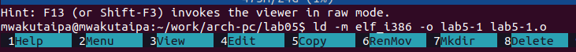
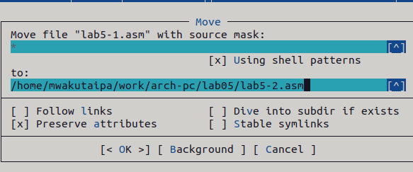
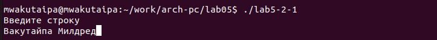

---
## Front matter
title: "Отчёт по лабораторной работе №5"
subtitle: "Дисциплина: Архитектура Компьютера"
author: "Вакутайпа Милдред"

## Generic otions
lang: ru-RU
toc-title: "Содержание"

## Bibliography
bibliography: bib/cite.bib
csl: pandoc/csl/gost-r-7-0-5-2008-numeric.csl

## Pdf output format
toc: true # Table of contents
toc-depth: 2
lof: true # List of figures
fontsize: 12pt
linestretch: 1.5
papersize: a4
documentclass: scrreprt
## I18n polyglossia
polyglossia-lang:
  name: russian
  options:
	- spelling=modern
	- babelshorthands=true
polyglossia-otherlangs:
  name: english
## I18n babel
babel-lang: russian
babel-otherlangs: english
## Fonts
mainfont: PT Serif
romanfont: PT Serif
sansfont: PT Sans
monofont: PT Mono
mainfontoptions: Ligatures=TeX
romanfontoptions: Ligatures=TeX
sansfontoptions: Ligatures=TeX,Scale=MatchLowercase
monofontoptions: Scale=MatchLowercase,Scale=0.9
## Biblatex
biblatex: true
biblio-style: "gost-numeric"
biblatexoptions:
  - parentracker=true
  - backend=biber
  - hyperref=auto
  - language=auto
  - autolang=other*
  - citestyle=gost-numeric
## Pandoc-crossref LaTeX customization
figureTitle: "Рис."
tableTitle: "Таблица"
listingTitle: "Листинг"
lofTitle: "Список иллюстраций"
lotTitle: "Список таблиц"
lolTitle: "Листинги"
## Misc options
indent: true
header-includes:
  - \usepackage{indentfirst}
  - \usepackage{float} # keep figures where there are in the text
  - \floatplacement{figure}{H} # keep figures where there are in the text
---

# Цель работы

Приобретение практических навыков работы в Midnight Commander. Освоение инструкций
языка ассемблера mov и int.

# Задание

1. Основы работы с mc
2. Подключение внешнего файла

# Выполнение лабораторной работы

**Основы работы с mc**

Открываю Midnight Commander, введя в терминал mc:

{#fig:001 width=70%}

Перехожу в каталог ~/work/arch-pc/, используя файловый менеджер mc:

{#fig:001 width=70%}

С помощью F7 создаю каталог lab05:

{#fig:001 width=70%}

{#fig:001 width=70%}

Пользуясь строкой ввода и командой touch создаю файл lab5-1.asm:

{#fig:001 width=70%}

{#fig:001 width=70%}

С помощью функциональной клавиши F4 открою файл lab5-1.asm для редактирования в nano:

{#fig:001 width=70%}

Ввожу в файл код программы для запроса строки у пользователя:

{#fig:001 width=70%}

С помощью функциональной клавиши F3 открываю файл для просмотра, чтобы проверить, что файл содержит текст программы:

{#fig:001 width=70%}

Транслирую текст программы файла в объектный файл командой nasm -f elf lab5-1.asm:

{#fig:001 width=70%}

Выполняю компоновку объектного файла с помощью команды ld -m elf_i386 -o lab5-1 lab5-1.o:

{#fig:001 width=70%}

Я запускаю получившийся исполняемый файл:

{#fig:001 width=70%}

Программа выводит строку “Введите строку:” и ждет ввода с клавиатуры, я ввожу мои ФИО:

{#fig:001 width=70%}

**Подключение внешнего файла in_out.asm**

Скачиваю файл in_out.asm со страницы курса в ТУИС:

{#fig:001 width=70%}

С помощью функциональной клавиши F5 копирую файл in_out.asm из каталога Downloads в каталог lab05. Потом копирую файл lab5-1.asm в тот же каталог, но с другим именем (lab5-2.asm) :

{#fig:001 width=70%}

{#fig:001 width=70%}

Изменяю содержимое файла lab5-2.asm в редакторе nano, чтобы в программе использовались подпрограммы из внешнего файла in_out.asm (и также использую подпрограммы sprintLF, sread и quit):

{#fig:001 width=70%}

Я транслирую текст программы файла в объектный файл командой nasm -f elf lab5-2.asm и выполняю я компоновку объектного файла с помощью команды ld -m elf_i386 -o lab5-2 lab5-2.o. Я запускаю получившийся исполняемый файл. Программа выводит строку “Введите строку ” и ждет ввода с клавиатуры:

{#fig:001 width=70%}

Я ввожу мои ФИО:

{#fig:001 width=70%}

В файле lab5-2.asm заменяю подпрограмму sprintLF на sprint, транслирую и запускаю получившийся исполняемый файл:

{#fig:001 width=70%}

{#fig:001 width=70%}

Разница в том, что после строки "Введите строку" нет дополнительной строки: 

{#fig:001 width=70%}

# Выполнение заданий для самостоятельной работы

Создаю копию файла lab5-1.asm с именем lab5-1-0.asm с помощью клавиши F5:
 
{#fig:001 width=70%}

С помощью клавиши F4, открываю созданный файл для редактирования в nano. Изменяю программу так, чтобы кроме вывода приглашения и запроса ввода, она выводила вводимую пользователем строку:

{#fig:001 width=70%}

Код программы:

``` SECTION .data
msg: DB 'Введите строку', 10

msgLen: EQU $-msg

SECTION .bss
buf1: RESB 80

SECTION .text
GLOBAL _start
 _start:

mov eax,4
mov ebx,1
mov ecx,msg
mov edx,msgLen
int 80h

mov eax,3
mov ebx,0
mov ecx,buf1
mov edx,80
int 80h

mov eax,4
mov ebx,1
mov ecx,buf1
mov edx,buf1
int 80h

mov eax,1
mov ebx,0
int 80h
```

Я транслирую и запускаю получившийся исполняемый файл:

{#fig:001 width=70%}

{#fig:001 width=70%}

{#fig:001 width=70%}

Программа запрашивает ввод, ввожу мои ФИО, далее программа выводит введенные данные:

{#fig:001 width=70%}

Создаю копию файла lab5-2.asm с именем lab5-2-1.asm с помощью функциональной клавиши F5 и открываю созданный файл для редактирования. Изменяю программу так, чтобы кроме вывода приглашения и запроса ввода, она выводила вводимую пользователем строку:

{#fig:001 width=70%}

Код программы:

```%include 'in_out.asm'
SECTION .data
msg: DB 'Введите строку', 10

msgLen: EQU $-msg

SECTION .bss
buf1: RESB 80

SECTION .text
GLOBAL _start
 _start:

mov eax,msg
call sprint

mov ecx,buf1
mov edx,80

call sread
mov eax,4
mov ebx,1
mov ecx,buf1
int 80h
call quit
```
Я транслирую и запускаю получившийся исполняемый файл:

{#fig:001 width=70%}

{#fig:001 width=70%}

{#fig:001 width=70%}

{#fig:001 width=70%}

# Выводы

При выполнении данной лабораторной работы я приобрела практические навыки работы в Midnight Commander, а также освоила инструкции языка ассемблера mov и int.

# Список литературы{.unnumbered}

[Архитектура ЭВМ](https://esystem.rudn.ru/pluginfile.php/2089085/mod_resource/content/0/%D0%9B%D0%B0%D0%B1%D0%BE%D1%80%D0%B0%D1%82%D0%BE%D1%80%D0%BD%D0%B0%D1%8F%20%D1%80%D0%B0%D0%B1%D0%BE%D1%82%D0%B0%20%E2%84%965.%20%D0%9E%D1%81%D0%BD%D0%BE%D0%B2%D1%8B%20%D1%80%D0%B0%D0%B1%D0%BE%D1%82%D1%8B%20%D1%81%20Midnight%20Commander%20%28%29.%20%D0%A1%D1%82%D1%80%D1%83%D0%BA%D1%82%D1%83%D1%80%D0%B0%20%D0%BF%D1%80%D0%BE%D0%B3%D1%80%D0%B0%D0%BC%D0%BC%D1%8B%20%D0%BD%D0%B0%20%D1%8F%D0%B7%D1%8B%D0%BA%D0%B5%20%D0%B0%D1%81%D1%81%D0%B5%D0%BC%D0%B1%D0%BB%D0%B5%D1%80%D0%B0%20NASM.%20%D0%A1%D0%B8%D1%81%D1%82%D0%B5%D0%BC%D0%BD%D1%8B%D0%B5%20%D0%B2%D1%8B%D0%B7%D0%BE%D0%B2%D1%8B%20%D0%B2%20%D0%9E%D0%A1%20GNU%20Linux.pdf)
