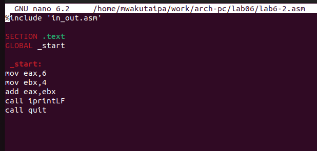
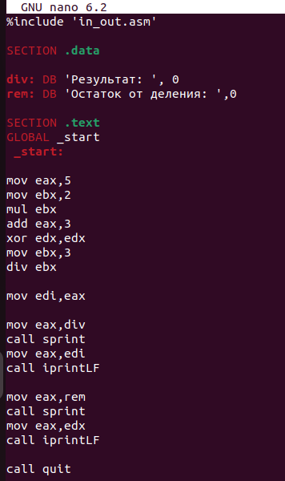

---
## Front matter
title: "Отчёт по лабораторной работе № 6"
subtitle: "Дисциплина: Архитектура компьютера"
author: "Вакутайпа Милдред"

## Generic otions
lang: ru-RU
toc-title: "Содержание"

## Bibliography
bibliography: bib/cite.bib
csl: pandoc/csl/gost-r-7-0-5-2008-numeric.csl

## Pdf output format
toc: true # Table of contents
toc-depth: 2
lof: true # List of figures
fontsize: 12pt
linestretch: 1.5
papersize: a4
documentclass: scrreprt
## I18n polyglossia
polyglossia-lang:
  name: russian
  options:
	- spelling=modern
	- babelshorthands=true
polyglossia-otherlangs:
  name: english
## I18n babel
babel-lang: russian
babel-otherlangs: english
## Fonts
mainfont: PT Serif
romanfont: PT Serif
sansfont: PT Sans
monofont: PT Mono
mainfontoptions: Ligatures=TeX
romanfontoptions: Ligatures=TeX
sansfontoptions: Ligatures=TeX,Scale=MatchLowercase
monofontoptions: Scale=MatchLowercase,Scale=0.9
## Biblatex
biblatex: true
biblio-style: "gost-numeric"
biblatexoptions:
  - parentracker=true
  - backend=biber
  - hyperref=auto
  - language=auto
  - autolang=other*
  - citestyle=gost-numeric
## Pandoc-crossref LaTeX customization
figureTitle: "Рис."
tableTitle: "Таблица"
listingTitle: "Листинг"
lofTitle: "Список иллюстраций"
lotTitle: "Список таблиц"
lolTitle: "Листинги"
## Misc options
indent: true
header-includes:
  - \usepackage{indentfirst}
  - \usepackage{float} # keep figures where there are in the text
  - \floatplacement{figure}{H} # keep figures where there are in the text
---

# Цель работы

Освоение арифметических инструкций языка ассемблера NASM.

# Задание

1. Символьные и численные данные в NASM
2. Выполнение арифметических операций в NASM
3. Ответы на вопросы по программе

# Выполнение лабораторной работы
 **1. Символьные и численные данные в NASM**

Создаю каталог для программам лабораторной работы № 6, перехожу в него и создаю файл lab6-1.asm:

{#fig:001 width=70%}

Копирую в текущий каталог файл in_out.asm,потому что  он будет использоваться в других программах:

{#fig:001 width=70%}

Открываю созданный файл lab6-1.asm, вставляю в него программу вывода значения регистра eax: 

{#fig:001 width=70%}

Создаю исполняемый файл программы и запускаю его. Программа выводит символ 'j', потому что это сумма кодов символов 6 и 4 по системе ASCII: 

{#fig:001 width=70%}

Изменяю текст программы и вместо символов, пишу в регистры числа:

{#fig:001 width=70%}

Создаю исполняемый файл программы и запускаю его. Теперь она выводит новую строку (код символа 10):

{#fig:001 width=70%}

Создаю новый файл lab6-2.asm:

{#fig:001 width=70%}

Открываю созданный файл lab6-2.asm, вставляю в него программу вывода значения регистра eax:

{#fig:001 width=70%}

Создаю исполняемый файл программы и запускаю его. Она выводит сумму кодов символ 6(54) и символ 4(52):

{#fig:001 width=70%}

{#fig:001 width=70%}

Изменяю текст программы и вместо символов, пишу в регистры числа:

{#fig:001 width=70%}

Создаю исполняемый файл программы и запускаю его. Теперь она выводит сумму чисел 6 и 4:

{#fig:001 width=70%}

Изменяю iprintLF в iprint:

{#fig:001 width=70%}

Создаю испольняемый файл и запускаю его:

{#fig:001 width=70%}

 **2. Выполнение арифметических операций в NASM**

Создаю новый файл lab6-3.asm:

{#fig:001 width=70%}

Вставляю в него программу для вычисления выражения f(x) = (5 * 2 + 3)/3 : 

{#fig:001 width=70%}

Создаю исполняемый файл и запускаю его:

{#fig:001 width=70%}

Изменяю текст программы для вычисления выражения f(x)=(4 * 6 + 2)/5:
 
{#fig:001 width=70%}

Создаю исполняемый файл и запускаю его:

{#fig:001 width=70%}

Создаю файл variant.asm:

{#fig:001 width=70%}

Ввожу в файл текст программы для вычисления варианта задания по номеру студенческого билета:
 
{#fig:001 width=70%}

Создаю исполняемый файл и запускаю его. Ввожу номер своего студенческого билета, программа выводит, вариант 10:

{#fig:001 width=70%}

**3. Ответы на вопросы по программе**

1. За вывод сообщения “Ваш вариант” отвечают строки кода:
```
mov eax,rem
call sprint

```

2. mov ecx, x используется, чтобы положить адрес вводимой строки x в регистр.
ecx mov edx,80-запись в регистр edx длины вводимой строки
call sread - вызов подпрограммы из внешнего файла, обеспечивающей ввод ообщения с клавиатуры

3. call atoi используется для вызова подпрограммы из внешнего файла, кото
рая преобразует ascii-код символа в целое число и записывает результат в
регистр eax

4. За вычисления варианта отвечают строки:
```
xor edx,edx 
mov ebx,20 
div ebx 
inc edx 

```
5. Остаток от деления записывается в регистр edx.

6. Инструкция inc edx используется для увеличения значения регистра edx на 1.

7. За вывод на экран результатов вычислений отвечают строки:
```
mov eax,edx
call iprintLF
```

# Выполнение самостоятельной работы 
 
Создаю файл task.asm:

{#fig:001 width=70%}

В него пишу программу для вычисления выражения f(x)=5(x + 18) - 28. Она берет входное значение " х ", прибавляет его к 18, умножает результат сложения на 5 а потом вычитает 28:

{#fig:001 width=70%}

Создаю исполняемый файл и запускаю его. При x = 2, она выводит 72. При x = 3, она выводит 77:

{#fig:001 width=70%}

{#fig:001 width=70%}

Код Программы:

```
%include 'in_out.asm' 

SECTION .data 
msg: DB 'Введите значение переменной х: ',0
rem: DB 'Результат: ',0

SECTION .bss 
x: RESB 80 
SECTION .text 
GLOBAL _start 
_start: 
mov eax, msg 
call sprint
 
mov ecx, x 
mov edx, 80 
call sread 

mov eax,x 
call atoi 

add eax,18
mov ebx,5
mul ebx
add eax,-28
mov edi,eax 

mov eax,rem 
call sprint 

mov eax,edi 
call iprint 
call quit 
```

# Выводы

При выполнении лабораторной работы я освоила арифметические инструкции языка ассемблера NASM.

# Список литературы{.unnumbered}

[Архитектура ЭВМ](https://esystem.rudn.ru/pluginfile.php/2089086/mod_resource/content/0/%D0%9B%D0%B0%D0%B1%D0%BE%D1%80%D0%B0%D1%82%D0%BE%D1%80%D0%BD%D0%B0%D1%8F%20%D1%80%D0%B0%D0%B1%D0%BE%D1%82%D0%B0%20%E2%84%966.%20%D0%90%D1%80%D0%B8%D1%84%D0%BC%D0%B5%D1%82%D0%B8%D1%87%D0%B5%D1%81%D0%BA%D0%B8%D0%B5%20%D0%BE%D0%BF%D0%B5%D1%80%D0%B0%D1%86%D0%B8%D0%B8%20%D0%B2%20NASM..pdf)
:::
