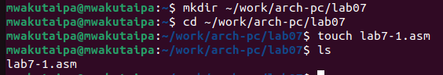
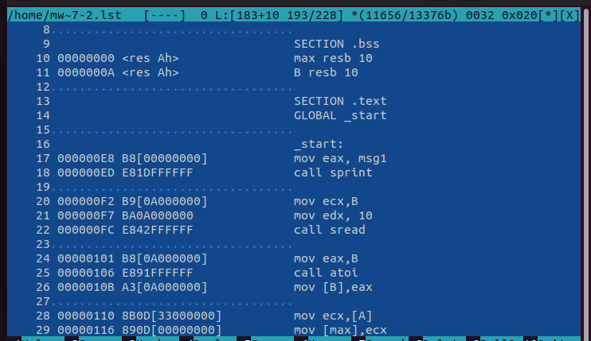

---
## Front matter
title: "Отчёт по лабораторной работе № 7"
subtitle: "Дисциплина: Архитектура компьютера"
author: "Вакутайпа Милдред"

## Generic otions
lang: ru-RU
toc-title: "Содержание"

## Bibliography
bibliography: bib/cite.bib
csl: pandoc/csl/gost-r-7-0-5-2008-numeric.csl

## Pdf output format
toc: true # Table of contents
toc-depth: 2
lof: true # List of figures
fontsize: 14pt
linestretch: 1.5
papersize: a4
documentclass: scrreprt
## I18n polyglossia
polyglossia-lang:
  name: russian
  options:
	- spelling=modern
	- babelshorthands=true
polyglossia-otherlangs:
  name: english
## I18n babel
babel-lang: russian
babel-otherlangs: english
## Fonts
mainfont: PT Serif
romanfont: PT Serif
sansfont: PT Sans
monofont: PT Mono
mainfontoptions: Ligatures=TeX
romanfontoptions: Ligatures=TeX
sansfontoptions: Ligatures=TeX,Scale=MatchLowercase
monofontoptions: Scale=MatchLowercase,Scale=0.9
## Biblatex
biblatex: true
biblio-style: "gost-numeric"
biblatexoptions:
  - parentracker=true
  - backend=biber
  - hyperref=auto
  - language=auto
  - autolang=other*
  - citestyle=gost-numeric
## Pandoc-crossref LaTeX customization
figureTitle: "Рис."
tableTitle: "Таблица"
listingTitle: "Листинг"
lofTitle: "Список иллюстраций"
lolTitle: "Листинги"
## Misc options
indent: true
header-includes:
  - \usepackage{indentfirst}
  - \usepackage{float} # keep figures where there are in the text
  - \floatplacement{figure}{H} # keep figures where there are in the text
---

# Цель работы

Цель этой работы - изучение команд условного и безусловного переходов. Приобретение навыков написания программ с использованием переходов. Знакомство с назначением и структурой файла листинга.

# Задание

1. Реализация переходов в NASM
2. Изучение структуры файлы листинга

# Выполнение лабораторной работы

**1. Реализация переходов в NASM**

Создаю каталог для программам лабораторной работы № 7, перехожу в него и создаю файл lab7-1.asm:

{#fig:001 width=70%}

Отркрываю файл lab7-1.asm и в него вставляю код программы, которая показывает как работает jmp:

{#fig:001 width=70%}

Создаю испольняемый файл и запускаю его. Программа выводит "сообщение № 2" и "сообщение № 3":

{#fig:001 width=70%}

Изменяю текст программы:

{#fig:001 width=70%}

Создаю испольняемый файл и запускаю его. Программа выводит "сообщение № 2" и "сообщение № 1":

{#fig:001 width=70%}

Изменяю текст программы, чтобы она выводила "сообщение № 3", "сообщение № 2" и "сообщение № 1":

{#fig:001 width=70%}

Создаю испольняемый файл и запускаю его:

{#fig:001 width=70%}

Создаю файл lab7-2.asm:

{#fig:001 width=70%}

В него вставляю код программы, которая определяет и выводит на экран наибольшую из 3 целочисленных переменных:

{#fig:001 width=70%}

{#fig:001 width=70%}

Создаю испольняемый файл и запускаю его:

{#fig:001 width=70%}

Проверяю работу для разных значений B:

{#fig:001 width=70%}


**2. Изучение структуры файлы листинга**

Создаю файл листинга для программы из файла lab7-2.asm:

{#fig:001 width=70%}

Открываю файл листинга lab7-2.lst с помощью mcedit:

{#fig:001 width=70%}

Это пример машинного кода сохранен в lab7-2.lst:

```
20 000000F2 B9[0A000000]	mov ecx,B
21 000000F7 BA0A000000		mov edx, 10
22 000000FC E842FFFFFF		call sread		
```
В lab7-2.asm, эти строки пренадзначены для ввода значения B.
20- номер строки, 000000F2- это смещение машинного кода от начала текущего сегмента (адрес), B9[0A000000]- машинный код и mov ecx,B- исходнный текст программы. 

Когда я удаляю строку для сравнения A и C, выполняю трансляцию с получением файла листинга, строка удаляется из файла .lst, и ничего не добавляется:

{#fig:001 width=70%}

{#fig:001 width=70%}

#Выполнение задания для самостоятельной работы

Создаю файл task1.asm:

{#fig:001 width=70%}

В него вставляю код программы, которая определяет  наименьшей из 3 целочисленных переменных a,b и c:

```
%include 'in_out.asm'

SECTION .data
msg1 db "Наимеьшее число: ",0h
A dd '41'
B dd '35'
C dd '62'

SECTION .bss
min resb 10

SECTION .text
GLOBAL _start

_start:

mov eax,B
call atoi
mov [B],eax

mov ecx,[A]
mov [min],ecx

cmp ecx,[C]
jl check_B
mov ecx,[C]
mov [min],ecx

check_B:
mov eax,min
call atoi
mov [min],eax

mov ecx,[min]
cmp ecx,[B]
jl fin
mov ecx,[B]
mov [min],ecx

fin:
mov eax,msg1
call sprint
mov eax,[min]
call iprintLF
call quit
```

{#fig:001 width=70%}

Создаю исполняемый файл и проверяю его работу для значения переменых из варианта 10:

{#fig:001 width=70%}

# Выводы

При выполнении лабораторной работы, я изучила команд условного и безусловного переходов в NASM.

# Список литературы

[Архитектура ЭВМ](https://esystem.rudn.ru/pluginfile.php/2089087/mod_resource/content/0/%D0%9B%D0%B0%D0%B1%D0%BE%D1%80%D0%B0%D1%82%D0%BE%D1%80%D0%BD%D0%B0%D1%8F%20%D1%80%D0%B0%D0%B1%D0%BE%D1%82%D0%B0%20%E2%84%967.%20%D0%9A%D0%BE%D0%BC%D0%B0%D0%BD%D0%B4%D1%8B%20%D0%B1%D0%B5%D0%B7%D1%83%D1%81%D0%BB%D0%BE%D0%B2%D0%BD%D0%BE%D0%B3%D0%BE%20%D0%B8%20%D1%83%D1%81%D0%BB%D0%BE%D0%B2%D0%BD%D0%BE%D0%B3%D0%BE%20%D0%BF%D0%B5%D1%80%D0%B5%D1%85%D0%BE%D0%B4%D0%BE%D0%B2%20%D0%B2%20Nasm.%20%D0%9F%D1%80%D0%BE%D0%B3%D1%80%D0%B0%D0%BC%D0%BC%D0%B8%D1%80%D0%BE%D0%B2%D0%B0%D0%BD%D0%B8%D0%B5%20%D0%B2%D0%B5%D1%82%D0%B2%D0%BB%D0%B5%D0%BD%D0%B8%D0%B9..pdf)
