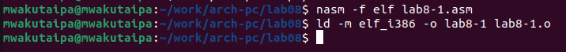

---
## Front matter
title: "Отчёт по лабораторной работе №8"
subtitle: "Дисциплина: Архитектура компьютера"
author: "Вакутайпа Милдред"

## Generic otions
lang: ru-RU
toc-title: "Содержание"

## Bibliography
bibliography: bib/cite.bib
csl: pandoc/csl/gost-r-7-0-5-2008-numeric.csl

## Pdf output format
toc: true # Table of contents
toc-depth: 2
lof: true # List of figures
fontsize: 14pt
linestretch: 1.5
papersize: a4
documentclass: scrreprt
## I18n polyglossia
polyglossia-lang:
  name: russian
  options:
	- spelling=modern
	- babelshorthands=true
polyglossia-otherlangs:
  name: english
## I18n babel
babel-lang: russian
babel-otherlangs: english
## Fonts
mainfont: PT Serif
romanfont: PT Serif
sansfont: PT Sans
monofont: PT Mono
mainfontoptions: Ligatures=TeX
romanfontoptions: Ligatures=TeX
sansfontoptions: Ligatures=TeX,Scale=MatchLowercase
monofontoptions: Scale=MatchLowercase,Scale=0.9
## Biblatex
biblatex: true
biblio-style: "gost-numeric"
biblatexoptions:
  - parentracker=true
  - backend=biber
  - hyperref=auto
  - language=auto
  - autolang=other*
  - citestyle=gost-numeric
## Pandoc-crossref LaTeX customization
figureTitle: "Рис."
listingTitle: "Листинг"
lofTitle: "Список иллюстраций"
lolTitle: "Листинги"
## Misc options
indent: true
header-includes:
  - \usepackage{indentfirst}
  - \usepackage{float} # keep figures where there are in the text
  - \floatplacement{figure}{H} # keep figures where there are in the text
---

# Цель работы

Цель лабораторной работы -- приобретение навыков написания программ с использованием циклов и обработкой аргументов командной строки.

# Задание

1. Реализация циклов в NASM
2. Обработка аргументов командной строки

# Выполнение лабораторной работы

**1. Реализация циклов в NASM**

Создаю каталог для программам лабораторной работы № 8, перехожу в него и создаю файл lab8-1.asm:

{#fig:001 width=70%}

В файле lab8-1.asm вставляю код программы, которая показывает, как инструкция loop использует регистр ecx в качестве счетчика и на каждом шаге уменьшает его значение на единицу:
 
{#fig:001 width=70%}

Создаю исполняемый файл:

{#fig:001 width=70%}

При запуске, программа выводит значение регистра ecx:

{#fig:001 width=70%}

Изменяю текст программы, чтобы она показала, что использование регистра ecx в теле цилка loop может привести к некорректной работе программы:

{#fig:001 width=70%}

Создаю исполняемый файл:

{#fig:001 width=70%}

При запуске, программа выводит бесконечное значение, которое не соответсвует значению N введенному с клавиатуры:

{#fig:001 width=70%}


{#fig:001 width=70%}

Для использования регистра ecx в цикле и сохранения корректности работы программы можно использовать стек. Изменяю текст программы добавив команды push и pop:

{#fig:001 width=70%}

Создаю исполняемый файл:

{#fig:001 width=70%}

При запуске, программа выводит значение, которое соответсвует значению N введенному с клавиатуры:

{#fig:001 width=70%}

{#fig:001 width=70%}


**2. Обработка аргументов командной строки**

Создаю файл lab8-2.asm:

{#fig:001 width=70%}

Ввожу в него текст программы, которая выводит на экран аргументы командной строки:

{#fig:001 width=70%}

Создаю исполняемый файл и запускаю его:

{#fig:001 width=70%}

Создаю файл lab8-3.asm:

{#fig:001 width=70%}

Ввожу в него текст программы, которая выводит на экран сумму аргументов:

{#fig:001 width=70%}

Создаю исполняемый файл и запускаю его:

{#fig:001 width=70%}

{#fig:001 width=70%}

Изменяю текст программы, чтобы она выводила произведение аргументов:

{#fig:001 width=70%}

Создаю исполняемый файл и запускаю его:

{#fig:001 width=70%}


# Выполнение самостоятельной работы

Создаю файл task8.asm:

{#fig:001 width=70%}

В него пишу программу, которая находит сумму значений функции f(x) = 5(2 + x)$ для некоторых значении x (вариант 10):

{#fig:001 width=70%}

Код программы:

```
%include 'in_out.asm'

SECTION .data
msg: DB 'Функция: f(x)=5(2+x)', 0
Sum: DB 'Результат: ',0
SECTION .text
global _start
_start:
mov eax, msg
call sprintLF

pop ecx         
pop edx        
sub ecx,1 
mov esi, 0
           
next:
cmp ecx,0h 
jz _end    
           
pop eax   
call atoi  
add eax,2
mov ebx,5
mul ebx
add esi,eax
loop next 

_end:

mov eax,Sum
call sprint

mov eax, esi 
call iprintLF
 
call quit
```

Создаю исполняемый файл и запускаю его. Программа выводит сумму f(1)+f(2)+f(1):

{#fig:001 width=70%}

# Выводы

При выполнение данной работы я освоила использование циклов и обработку аргументов командной строки.

# Список литературы

[Архитектура ЭВМ](https://esystem.rudn.ru/pluginfile.php/2089095/mod_resource/content/0/%D0%9B%D0%B0%D0%B1%D0%BE%D1%80%D0%B0%D1%82%D0%BE%D1%80%D0%BD%D0%B0%D1%8F%20%D1%80%D0%B0%D0%B1%D0%BE%D1%82%D0%B0%20%E2%84%968.%20%D0%9F%D1%80%D0%BE%D0%B3%D1%80%D0%B0%D0%BC%D0%BC%D0%B8%D1%80%D0%BE%D0%B2%D0%B0%D0%BD%D0%B8%D0%B5%20%D1%86%D0%B8%D0%BA%D0%BB%D0%B0.%20%D0%9E%D0%B1%D1%80%D0%B0%D0%B1%D0%BE%D1%82%D0%BA%D0%B0%20%D0%B0%D1%80%D0%B3%D1%83%D0%BC%D0%B5%D0%BD%D1%82%D0%BE%D0%B2%20%D0%BA%D0%BE%D0%BC%D0%B0%D0%BD%D0%B4%D0%BD%D0%BE%D0%B9%20%D1%81%D1%82%D1%80%D0%BE%D0%BA%D0%B8..pdf)
