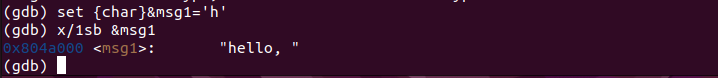

---
## Front matter
title: "Отчёт по лабораторной работе"
subtitle: "Дисциплина: Архитектура компьютера"
author: "Вакутайпа Милдред"

## Generic otions
lang: ru-RU
toc-title: "Содержание"

## Bibliography
bibliography: bib/cite.bib
csl: pandoc/csl/gost-r-7-0-5-2008-numeric.csl

## Pdf output format
toc: true # Table of contents
toc-depth: 2
lof: true # List of figures
fontsize: 14pt
linestretch: 1.5
papersize: a4
documentclass: scrreprt
## I18n polyglossia
polyglossia-lang:
  name: russian
  options:
	- spelling=modern
	- babelshorthands=true
polyglossia-otherlangs:
  name: english
## I18n babel
babel-lang: russian
babel-otherlangs: english
## Fonts
mainfont: PT Serif
romanfont: PT Serif
sansfont: PT Sans
monofont: PT Mono
mainfontoptions: Ligatures=TeX
romanfontoptions: Ligatures=TeX
sansfontoptions: Ligatures=TeX,Scale=MatchLowercase
monofontoptions: Scale=MatchLowercase,Scale=0.9
## Biblatex
biblatex: true
biblio-style: "gost-numeric"
biblatexoptions:
  - parentracker=true
  - backend=biber
  - hyperref=auto
  - language=auto
  - autolang=other*
  - citestyle=gost-numeric
## Pandoc-crossref LaTeX customization
figureTitle: "Рис."
listingTitle: "Листинг"
lofTitle: "Список иллюстраций"
lolTitle: "Листинги"
## Misc options
indent: true
header-includes:
  - \usepackage{indentfirst}
  - \usepackage{float} # keep figures where there are in the text
  - \floatplacement{figure}{H} # keep figures where there are in the text
---

# Цель работы

Приобретение навыков написания программ с использованием подпрограмм. Знакомство
с методами отладки при помощи GDB и его основными возможностями.

# Задание

1. Реализация подпрограмм в NASM
2. Отладка программам с помощью GDB

# Выполнение лабораторной работы

**Реализация подпрограмм в NASM**

Создаю каталог для выполнения лабораторной работы № 9, перехожу0 в него и создаю файл lab09-1.asm:

{#fig:001 width=70%}

Ввожу в файл lab09-1.asm текст программы для вычисления арифметического выражения f(x) = 2x + 7 с помощью подпрограммы _calcul:

{#fig:001 width=70%}

Создаю исполняемый файл и проверяю его работу:

{#fig:001 width=70%}

Изменяю текст программы, добавляя подпрограмму _subcalcul в подпрограмму _calcul, для вычисления выражения f(g(x)), где x вводится с клавиатуры, f(X) = 2x + 7, g(x) = 3x -1:

{#fig:001 width=70%}

Создаю исполняемый файл и проверяю его работу:

{#fig:001 width=70%}

**Отладка программам с помощью GDB**

Создаю файл lab09-2.asm с текстом программы для печати сообщения Hello world!:

{#fig:001 width=70%}

Создаю исполняемый файл добавляя ключ '-g', для работы с GDB:

{#fig:001 width=70%}

Загружаю исполняемый файл в отладчик gdb:

{#fig:001 width=70%}

Проверяю работу программы, запуская ее в оболочке GDB с помощью команды run:

{#fig:001 width=70%}

После установки брейкпоинт на метку _start, запускаю программу для более подробного анализа:

{#fig:001 width=70%}

С помощью команды disassemble начиная с метки _start, смотрю дисассимилированный код программы:

{#fig:001 width=70%}

Переключаюсь на отображение команд с Intel’овским синтаксисом, введя команду set disassembly-flavor intel:

{#fig:001 width=70%}

 В синтаксе ATT первый операнд является источником, а второй является пунктом назначения(напр. $0x4,%eax). В синтаксе Intel, первый операнд является пунктом назначения, а второй является источником ( напр. eax,0x4).

Включаю режим псевдографики для более удобного анализа программы используя layout asm и  layout regs:

{#fig:001 width=70%}

В верхней части должно быть названия регистров и их текущие значения, в средней части виден результат дисассимилирования программы и нижняя часть доступна для ввода команд.

**Добавление точек останова**

На предыдущих шагах была установлена точка останова по имени метки _start.Проверяю это с помощью команды info breakpoints (i b):

{#fig:001 width=70%}

Установливаю еще одну точку останова по адресу инструкции (mov ebx,0x0) используя break *<адрес> и смотрю информацию о всех установленных точках останова:

{#fig:001 width=70%}

**Работа с данными программы в GDB**

Выполняю 5 инструкций с помощью команды stepi (si):

{#fig:001 width=70%}

С помощью команды x &<имя переменной>, смотрю значение переменной msg1 по имени:

{#fig:001 width=70%}

С помощью команды x/NFU <адрес>, смотрю значение переменной msg2 по адресу:

{#fig:001 width=70%}

Изменяю первый символ переменной msg1 и msg2 с помощью команды set:

{#fig:001 width=70%}

{#fig:001 width=70%}

Команда print/F <val> используется для просмотра значений регистров. Вывожу значение регистра edx в двоичном формате, в шестнадцатеричном формате и в символьном виде:

{#fig:001 width=70%}

С помощью команды set изменяю значение регистра ebx:

{#fig:001 width=70%}

(gdb) set $ebx='2' - изменяет значение ebx на значение символа в двоичном формате 2(50). (gdb) set $ebx=2 изменяет значение ebx на 2.

**Обработка аргументов командной строки в GDB**

Копирую файл lab8-2.asm, созданный при выполнении лабораторной работы №8, с программой выводящей на экран аргументы командной строки, в файл с именем lab09-3.asm:

{#fig:001 width=70%}

Создаю исполняемый файл:

{#fig:001 width=70%}

Загружаю исполняемый файл в отладчик  с ключом --args, указивая аргументы:

{#fig:001 width=70%}

Установливаю точку останова перед первой инструкцией в программе и запускаю ее:

{#fig:001 width=70%}

Адрес вершины стека храниться в регистре esp и по этому адресу располагается число равное количеству аргументов командной строки (включая имя программы), здесь число аргументов равно 5:

{#fig:001 width=70%}

Размер шага изменения адреса по умолчанию равен 4 при отладке программы на архитектуре x86. Это связано с тем, что в 32-битных системах адреса памяти обычно представляются как 32-битные числа, и каждый адрес соответствует одному байту:

{#fig:001 width=70%}


# Выполнение самостоятельной работы


**Задание 1**

Копирую файл task8.asm, созданный при выполнении лабораторной работы №8, с программой выводящей на экран сумму значений функции f(x) = 5(2 + x) для некоторых значении x (аргументы командной строки), в файл с именем task9-1.asm:

{#fig:001 width=70%}

Редактирую программу для вычисление значения функции f(x) как подпрограмму:

{#fig:001 width=70%}

Создаю исполняемый файл и проверяю его работу:

{#fig:001 width=70%}

Код программы:
```
%include 'in_out.asm'

SECTION .data
msg: DB 'Введите x: ',0
msg1: DB 'Функция: f(x)=5(2+x)', 0
Sum: DB 'Результат: ',0

SECTION .bss
x: RESB 80
ans: RESB 80

SECTION .text
global _start
_start:

mov eax, msg
call sprintLF

mov ecx,x
mov edx,80
call sread

mov eax,x
call atoi

call _sub

mov eax,msg1
call sprintLF

mov eax,Sum
call sprint
mov eax,[ans]
call iprintLF

call quit

_sub:
add eax,2
mov ebx,5
mul ebx
mov [ans],eax

ret

mov eax, esi 
call iprintLF
 
call quit
```

**Задание 2**

Создаю файл task9-2.asm и вставляю в него программу вычисления выражения(3+2)∗4+5:

{#fig:001 width=70%}

Создаю испольняемый файл:

{#fig:001 width=70%}

При запуске она выводит неверный результат:

{#fig:001 width=70%}

Переключаюсь на отображение команд с Intel’овским синтаксисом:

{#fig:001 width=70%}

Включаю режим псевдографики для более удобного анализа программы используя layout asm:

{#fig:001 width=70%}

С помощью layout regs, я могу видеть названия регистров и их текущие значения. Выполняю 6 инструкций с помощью команды stepi (si) и при этом замечаю ,что после того как программа суммирует 3 и 2, значение храняется в регистре ebx. Значение регистра ecx(4) умножает на 2(значение регистра eax) а затем суммирует 5 и значение регистра ebx (5):

{#fig:001 width=70%}

Исправляю код ,чтобы программа выводила правильный ответ:

{#fig:001 width=70%}


{#fig:001 width=70%}

Код программы:

```
%include 'in_out.asm'

SECTION .data
div: DB 'Результат: ',0

SECTION .text
GLOBAL _start
_start:
; ---- Вычисление выражения (3+2)*4+5
mov ebx,3
mov eax,2
add eax,ebx
mov ecx,4
mul ecx
add eax,5
mov edi,eax
; ---- Вывод результата на экран
mov eax,div
call sprint
mov eax,edi
call iprintLF
call quit

```

# Выводы

При выполнении данной работы я освоила написание программ с использованием подпрограмм и знакомила методы отладки при помощи GDB и его основные возможности.

# Список литературы

[Архитектура ЭВМ](https://esystem.rudn.ru/pluginfile.php/2089096/mod_resource/content/0/%D0%9B%D0%B0%D0%B1%D0%BE%D1%80%D0%B0%D1%82%D0%BE%D1%80%D0%BD%D0%B0%D1%8F%20%D1%80%D0%B0%D0%B1%D0%BE%D1%82%D0%B0%20%E2%84%969.%20%D0%9F%D0%BE%D0%BD%D1%8F%D1%82%D0%B8%D0%B5%20%D0%BF%D0%BE%D0%B4%D0%BF%D1%80%D0%BE%D0%B3%D1%80%D0%B0%D0%BC%D0%BC%D1%8B.%20%D0%9E%D1%82%D0%BB%D0%B0%D0%B4%D1%87%D0%B8%D0%BA%20..pdf)
